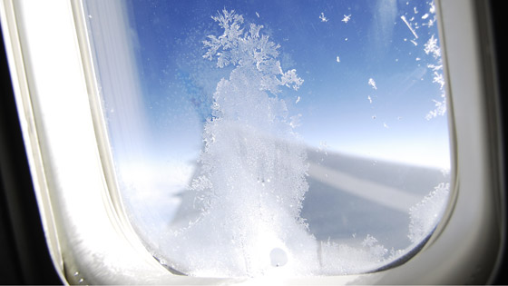
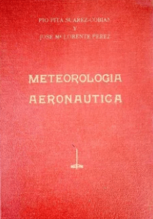
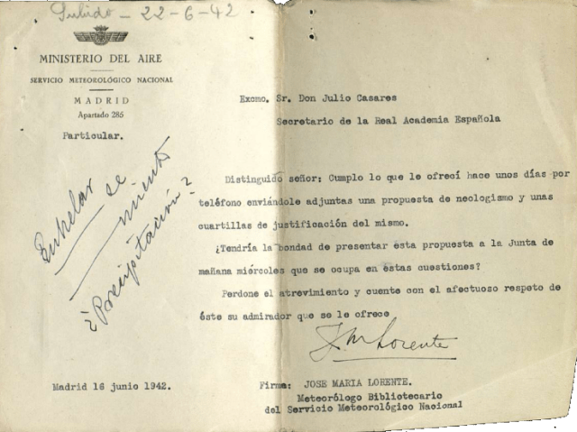

# Engelamiento: la invención de una palabra aeronáutica

- Fuente: https://aemetblog.es/2026/02/12/engelamiento-la-invencion-de-una-palabra-aeronautica/
- Fecha detectada: 2026-02-12T07:00:00+00:00
- Extraído: 2026-02-13T00:33:46
- Imágenes detectadas: 8

---

- AEMET EN ACCIÓN
- ACTUALIDAD METEOROLÓGICA
- ENTENDER LA METEOROLOGÍA
- CAMBIO CLIMÁTICO
- EFEMÉRIDES METEOROLÓGICAS
- PREDICCIONES ESPECÍFICAS
- RESÚMENES CLIMATOLÓGICOS
- BIBLIOTECA AEMET
- PODCAST

## Engelamiento: la invención de una palabra aeronáutica

Un artículo de Alejandro MÉNDEZ FRADES , Agencia Estatal de Meteorología (AEMET)

1. LA NECESIDAD DE NOMINAR A UNO DE LOS «MAYORES PELIGROS DE LA NAVEGACIÓN AÉREA»

La deposición de hielo sobre el fuselaje de una aeronave constituye uno de los fenómenos de impacto más reconocibles en el contexto de la preservación de la seguridad operacional de los vuelos. De hecho, se trata del más importante en cuanto al riesgo durante la fase de ruta o de crucero pues origina, como efectos más inmediatos, la degradación del perfil aerodinámico de la aeronave y un aumento de su peso que, a su vez, se materializa en una reducción de la velocidad debido al aumento de la fricción, una mayor vulnerabilidad de los instrumentos de medida a bordo a reportar fallos o incluso la reducción de la visibilidad por acumulación de hielo en las ventanillas (figura 1).

El engelamiento es un proceso de naturaleza microfísica consecuencia de la interacción de las características de la aeronave con el entorno. En la atmósfera suele producirse, por lo general, a temperaturas comprendidas entre –2 °C y –20 °C. Para su formación, es necesario disponer de suficiente contenido de agua líquida y que las temperaturas ambiente y de la propia aeronave sean inferiores a 0 °C. Termodinámicamente, las gotas de agua subfundidas (agua líquida por debajo de 0 °C), al impactar contra el avión, se congelan de forma instantánea liberando calor latente, el cual es absorbido por la estructura del avión y por las gotas no congeladas, las cuales se evaporan originando un enfriamiento que ayuda a congelar el resto de gotitas (González López, 2014).

El interés por este meteoro surgió cuando se constató in situ , formándose a bordo de las primeras aeronaves cuando atravesaban formaciones nubosas de diversa índole: de gran desarrollo vertical, a sotavento de una cadena montañosa o incluso en el seno de una bruma o niebla. En España, su importancia se acrecentó al albur de las primeras demandas de información meteorológica aeronáutica, coincidiendo con la apertura de las líneas aéreas o de la organización de los grandes viajes aéreos de carácter expedicionario (o raids ) que lograron acortar el mundo y sentar las bases de la incipiente industria aeronáutica española (Plus Ultra, Jesús del Gran Poder, etc.).

Varios de los Auxiliares de Meteorología de la denominada generación del 21 (Palomares y Méndez, 2021) asumieron las primeras consultas de las grandes rutas aéreas, destacando especialmente los casos de José María Lorente Pérez (1891-1983) y Francisco Morán Samaniego (1901-1984). A petición del entonces jefe del Servicio Meteorológico Español, Enrique Meseguer, Lorente abordó minuciosamente la Preparación Meteorológica del viaje aéreo de Sevilla a Buenos Aires (1927)mientras que Morán firmó un solvente Estudio climatológico de la parte de zona tórrida comprendida entre los meridianos 40 y 160 E (1929) que mereció los honores de la imprenta. Por entonces, los Meteorólogos y Auxiliares conformaban un solo Cuerpo con dos Escalas. Sus miembros ingresaban como Auxiliares y ascendían a Meteorólogos cuando contaban con una antigüedad de, al menos, tres años, además de presentar una memoria científica y de cumplir con algunas disposiciones académicas. Los dos trabajos mencionados dieron contenido a las preceptivas memorias que Lorente y Morán tuvieron que aportar para certificar su ascenso a Meteorólogo en 1929.

La vocación aeronáutica de Lorente (figura 2) se estimuló a raíz de su estudio sobre las «circunstancias de índole atmosférica que hubieran de interesar a la navegación aérea en la línea de Sevilla a Buenos Aires» 1 , hasta el punto de dirigirse al presidente de la Junta de Ampliación de Estudios e Investigaciones Científicas para solicitarle «una pensión para que pudiese trasladarse a Alemania y residir en Lindenberg durante tres meses» con el firme propósito de conocer «la preparación meteorológica de viajes aéreos». El 9 de junio de 1927 la Junta resolvió a su favor, haciendo factible esta estancia que aprovecharía para abordar este asunto que era estratégico para el Servicio Meteorológico, como así se desprende de un oficio que Meseguer dirigió, días después, al director del Instituto Geográfico y Catastral:

> «Dada la escasez de personal de meteorología, es de sentir que este apartamiento eventual pero no hay duda de que el viaje será fructífero pues el Sr. Lorente está técnicamente preparado con los estudios que le encomendé y posee además el idioma alemán» 2

«Dada la escasez de personal de meteorología, es de sentir que este apartamiento eventual pero no hay duda de que el viaje será fructífero pues el Sr. Lorente está técnicamente preparado con los estudios que le encomendé y posee además el idioma alemán» 2

Años después de su periplo alemán, Lorente publicó junto con Pío Pita (fig. 4) Meteorología Aeronáutica (1942), la primera monografía en castellano que, estructurada en una cuidada presentación y conducida con un tono pedagógico, aborda los meteoros de interés para la aviación y la dimensión operativa de lo que entonces se conocía como «servicio de protección de vuelos» 3 . En cuanto a la fenomenología atmosférica, los autores dedicaron un apartado para describir esa contaminación en forma de depósito de hielo que se origina sobre las alas y el fuselaje de las aeronaves, y sobre la que eran conscientes de que, en castellano, aún no se contaba con un nombre:

> «A este fenómeno, llamado por los alemanes vereisung , por los ingleses ice accretion , por los italianos incrostazioni di ghiaccio y por los franceses givrage , y nosotros proponemos designarle en castellano con la palabra engelamiento o engelado (1)»

«A este fenómeno, llamado por los alemanes vereisung , por los ingleses ice accretion , por los italianos incrostazioni di ghiaccio y por los franceses givrage , y nosotros proponemos designarle en castellano con la palabra engelamiento o engelado (1)»

La importancia histórica de esta obra radica en que fue la primera en mencionar la palabra engelamiento , aunque no sin ciertas reservas por parte de sus autores, a tenor de la nota al pie que incluyeron a continuación:

> «(1): Personas muy autorizadas proponen enhelamiento o enhelado »

«(1): Personas muy autorizadas proponen enhelamiento o enhelado »

El solvente conocimiento que se tenía sobre este fenómeno contrastaba con la falta de consenso en cuanto a su nominación en castellano. En el Cursillo de Meteorología (1939) de Pita, explicado en la escuela de vuelos sin visibilidad de Matacán, se refiere a este asépticamente como «depósito de hielo». Por su parte, los Elementos de Meteorología (1943) de Fontseré lo bautiza como «incrustaciones de hielo», considerándolo como una especie de «escarchado del aparato» que se origina como consecuencia de la formación de un depósito coherente de hielo sobre la estructura de la aeronave 4 .

El Manual del Observador de Meteorología (1956) de Jansà Guardiola será la tercera obra en secundar la nueva terminología (p. 89):

«Los aviadores lo denominan muchas veces formación de hielo , y antes se llamó también incrustación , aunque el término engelamiento es el más apropiado».

Engelamiento , enhelamiento, depósito de hielo o incrustaciones de hielo revelan la incapacidad del castellano en su intento por encontrar un nombre apropiado para este fenómeno que había adquirido la categoría de «peligro» 5 para los vuelos.

El 16 de junio de 1942 Lorente envió una propuesta del neologismo engelar o engelarse al secretario de la Real Academia Española (RAE), Julio Casares Sánchez, con el objeto de que esta palabra, de nueva creación, fuese discutida en el seno de la Comisión de los Diccionarios y, en última instancia, ser admitida en el repertorio más importante de la lengua española. Su carta la firma como «Meteorólogo Bibliotecario del Servicio Meteorológico Nacional» 6 (figura 5)

Lorente y Pita aspiraban a contar con el aval de la docta institución en su propósito de promover esta nueva palabra. En su memoria justificativa planteaban:

> «Vencidas ya por la técnica aeronáutica muy espinosas dificultades, lucha actualmente (1942) por salvar un peligro grave que se le presenta desde que los Aviadores se atrevieron a volar entre nubes: las adherencias de hielo. Recubren éstas el aeroplano y especialmente todas las aristas que se enfrentan con el aire, cuando las gotillas de la nube están en sobrefusión, es decir, líquidas todavía aunque a temperaturas inferiores a la de congelación (0 °C), sin bajar generalmente de unos °6 bajo cero y en ese estado, muy inestable, chocan con el aparato. Sucede entonces que bruscamente pasan al estado de hielo, quedando soldadas entre sí y adheridas al avión al cual ponen en grave riesgo de perder la sustentación y gobierno por aumentar su peso […]. Este fenómeno es el que hay que designar en castellano con alguna palabra y los firmantes que suscriben proponen que sean ENGELAR o ENGELARSE, con sus derivados ENGELADO, ENGELAMIENTO, etc.»

«Vencidas ya por la técnica aeronáutica muy espinosas dificultades, lucha actualmente (1942) por salvar un peligro grave que se le presenta desde que los Aviadores se atrevieron a volar entre nubes: las adherencias de hielo. Recubren éstas el aeroplano y especialmente todas las aristas que se enfrentan con el aire, cuando las gotillas de la nube están en sobrefusión, es decir, líquidas todavía aunque a temperaturas inferiores a la de congelación (0 °C), sin bajar generalmente de unos °6 bajo cero y en ese estado, muy inestable, chocan con el aparato. Sucede entonces que bruscamente pasan al estado de hielo, quedando soldadas entre sí y adheridas al avión al cual ponen en grave riesgo de perder la sustentación y gobierno por aumentar su peso […]. Este fenómeno es el que hay que designar en castellano con alguna palabra y los firmantes que suscriben proponen que sean ENGELAR o ENGELARSE, con sus derivados ENGELADO, ENGELAMIENTO, etc.»

La congelación por contacto en superficie se conoce como cencellada (o cenceñada ), la cual consiste en un depósito de hielo formado por la congelación de gotitas de agua subfundidas de niebla sobre objetos. Sin embargo, la congelación por contacto en altura y sobre la estructura de una aeronave, aun tratándose de un fenómeno análogo a lo que ocurre en superficie, carecía de una nomenclatura y, a juicio de Lorente y Pita, no parecía oportuno adaptar aeronáuticamente el nombre de cencellada. Había un matiz que los diferenciaba:

> «Si la cencellada (o cenceñada) se produce cuando la niebla muy fría choca con objetos fijos, en el caso de una aeronave, es el propio aparato el que se mueve entre las formaciones nubosas, dotadas de menor velocidad que éste»

«Si la cencellada (o cenceñada) se produce cuando la niebla muy fría choca con objetos fijos, en el caso de una aeronave, es el propio aparato el que se mueve entre las formaciones nubosas, dotadas de menor velocidad que éste»

> «La diferenciación no está más que en el estado de reposo o de movimiento relativo del objeto que recibe el depósito».

«La diferenciación no está más que en el estado de reposo o de movimiento relativo del objeto que recibe el depósito».

La clave, por tanto, está en la cinemática del depósito. Si en la cencellada este se encuentra en reposo con respecto al medio, en el engelamiento ocurre lo contrario: la superficie «que se engela» es la que está en movimiento en comparación con su entorno. De esta forma, Lorente y Pita idearon la palabra engelamiento a partir de los siguientes elementos constitutivos:

- raíz latina: GEL, helar (la «g» latina es uno de los orígenes de la «h» en español);
- se antepone el prefijo EN, formando ENGELAR: recubrirse de hielo, por semejanza con enlodarse (recubrirse de hielo), engrasarse (recubrirse de grasa), encerarse , (recubrirse de cera) o enquistarse (embutirse y encajarse).

Cuatro días después, el 20 de junio de 1942, la RAE, a través de Casares, remitió una respuesta donde, a pesar de ponderar positivamente la fundamentación propuesta por los meteorólogos, la consideró inviable a efectos de incorporarse en el Diccionario. Sin embargo, no cerró tal posibilidad siempre y cuando se abordara la siguiente modificación:

> «El verbo engelar o engelarse, formado por el prefijo en y del gelare latino, tiene el carácter de vocablo híbrido, cosa que aun no siendo inusitada en nuestro léxico científico, debe evitarse a ser posible. […] Para que la formación moderna sea completamente correcta, habrían de ser elementos castellanos los que la integrasen, cosa fácil de resolver puesto que en vez de gelar, gelamiento, gelado, etc., tenemos ya en nuestra lengua helar, helamiento, helado, el nuevo juego de vocablos podría ser: enhelar, enhelamiento o enheladura».

«El verbo engelar o engelarse, formado por el prefijo en y del gelare latino, tiene el carácter de vocablo híbrido, cosa que aun no siendo inusitada en nuestro léxico científico, debe evitarse a ser posible. […] Para que la formación moderna sea completamente correcta, habrían de ser elementos castellanos los que la integrasen, cosa fácil de resolver puesto que en vez de gelar, gelamiento, gelado, etc., tenemos ya en nuestra lengua helar, helamiento, helado, el nuevo juego de vocablos podría ser: enhelar, enhelamiento o enheladura».

La postura de la RAE era refractaria a reconocer un neologismo castellano cimentado, a su vez, en elementos de origen castellano y latino respectivamente. Si el neologismo es castellano, sus constituyentes también debían de serlo. Por este motivo, se incluyó la mencionada nota al pie de la página 162 en Meteorología aeronáutica , una especie de disclaimer por la que los autores no renunciaban a su empeño, aun reconociendo la postura de la Academia.

Con los años, los usos y costumbres de la comunidad meteorológica española lograron lo que inicialmente se intentó a través de cauces formales. Los programas de formación que el servicio meteorológico promueve a sus miembros, su estrecho vínculo con la Universidad y la indiscutible proyección global que dispone a través de la Organización Meteorológica Mundial (OMM) favoreció progresivamente el arraigo de esta novedosa palabra. El espaldarazo más importante vino en 1953 cuando la Comisión de Bibliografía y Publicación de la Organización Meteorológica Mundial (OMM) acordó la elaboración de un léxico en cuatro idiomas. La labor de este grupo cristalizó en 1966 con la publicación de la primera edición del Vocabulario Meteorológico Internacional (OMM-núm. 182), un corpus compuesto por unos dos mil términos expresados en cuatro idiomas. La versión castellana, que preparó Inocencio Font Tullot, incorporó el engelamiento junto a sus análogos aircraft ice accretion (inglés) y givrage d’aéronef (francés), favoreciendo su uso en los países latinoamericanos 7 .

El compendio léxico de la OMM animó la publicación de otros manuales en español, como el Vocabulario de términos meteorológicos y de ciencias afines (1986) de Ascaso y Casals o el Diccionario de meteorología (1986) de Catalá, sucesor de Morán al frente de la cátedra de Física del Aire en la Universidad Complutense de Madrid. Ambos incluyeron el engelamiento en sus respectivos contenidos.

Francisco Morán fue el primero en reconocer a los creadores de esta palabra, de acuerdo a la nota al pie que incorporó en la página 276 de sus Apuntes de Termodinámica de la atmósfera (1944), juzgándola como una «acertada denominación introducida por Pita y Lorente». En la misma línea, Alberto Linés desveló, años después, la trastienda histórica que aquí se ha referido en un trabajo manuscrito que tituló Diferentes tipos de hielo que se forman en las líneas eléctricas aéreas (1998):

> «Desde tiempos lejanos se ha venido observando que la niebla helada recubre de hielo con facilidad las caras de los objetos expuestos al viento. A este fenómeno llaman los ingleses icing o ice accretion , los franceses givrage . En España, Pita y Lorente propusieron el neologismo engelamiento no aceptado por la Academia» 8

«Desde tiempos lejanos se ha venido observando que la niebla helada recubre de hielo con facilidad las caras de los objetos expuestos al viento. A este fenómeno llaman los ingleses icing o ice accretion , los franceses givrage . En España, Pita y Lorente propusieron el neologismo engelamiento no aceptado por la Academia» 8

En general, el Diccionario constituye un registro global de las palabras que articulan la lengua castellana. Su carácter cambiante y la multiplicidad de las diversas acepciones están prácticamente al dictado de las dinámicas y costumbres asumidas por sus hablantes.

El criterio lingüístico que frustró la incorporación del engelamiento no impidió que, con los años, echara raíces en el argot meteorológico. El motivo más inmediato que lo justifica podría encontrarse en el contexto internacional, donde los servicios meteorológicos actúan como embajadores de la lengua de su país de procedencia, una cuestión muy palpable cuando se promueve la elaboración de compendios o se acuerdan iniciativas armonizadoras del léxico meteorológico. Asimismo, los programas de formación que impulsan los servicios meteorológicos crean un entorno favorable al consenso en cuanto al uso de determinados tecnicismos o traducciones por parte de sus profesionales.

En la última edición del Diccionario de la Lengua Española (2024), la Real Academia incorporó la palabra dana (en minúscula), un neologismo que surgió en los años noventa en honor al meteorólogo Francisco García Dana. A día de hoy, el engelamiento sigue sin estar documentado en el prestigioso corpus de nuestra lengua a pesar de aludir a una de las principales causas de accidentes e incidentes en la aviación.

Ascaso Liria, A. y Casals Marcén, M., 1986. Vocabulario de términos meteorológicos y de ciencias afines . Instituto Nacional de Meteorología. 408 pp. La definición de engelamiento se halla en la p. 129.

Catalá de Alemany, J., 1986. Diccionario de meteorología . Alhambra. 270 pp. La definición del engelamiento puede consultarse en la p. 91.

Fontseré Riba, E., 1943. Elementos de Meteorología . Editorial Gustavo Gili. 358 pp. En relación al engelamiento, véase la definición incluida en la p. 314.

González López, B., 2014. Meteorología aeronáutica . Editorial AVA (Actividades Varias Aeronáuticas). 1.ª edición: Año 2005. 385 pp. Para entender el proceso físico del engelamiento, véase el capítulo 17, apartados 1 y 2.

Jansà Guardiola, J. M., 1956. Manual del Observador de Meteorología . Serie B (textos) de Publicaciones del Servicio Meteorológico Nacional (núm. 12). 400 pp. El concepto de engelamiento se encuentra en la p. 89.

Linés Escardó, A., 1998. Diferentes tipos de hielo que se forman en las líneas eléctricas aéreas . Manuscrito mecanografiado conservado en la Biblioteca de los Servicios Centrales de AEMET.

Morán Samaniego, F., 1944. Apuntes de Termodinámica de la atmósfera (1944). Serie B (textos) de Publicaciones del Servicio Meteorológico Nacional (núm. 4). 345 pp. Los autores del neologismo engelamiento se encuentran en la p. 276.

Palomares Calderón, M. y Méndez Frades, A., 1921. Un centenario a recordar . Calendario Meteorológico de AEMET. pp. 267-275.

Pita Suárez-Cobián, P., 1939. Cursillo de meteorología. Serie B (textos) de Publicaciones del Servicio Meteorológico Nacional (núm. 1). 64 pp.

Pita Suárez-Cobián, P. y Lorente Pérez, J. M., 1942. Meteorología aeronáutica . Sociedad Anónima Española de Traductores y Autores (SAETA), 243 pp. Organización Meteorológica Mundial (OMM), 1992. Vocabulario meteorológico internacional de la Organización Meteorológica Mundial (OMM núm. 182). Primera edición de 1966. Hay una segunda edición del año 1992. Es la obra donde se recoge todo el léxico meteorológico en cuatro idiomas. En la actualidad existe el repositorio METEOTERM/UNTERM: https://unterm.un.org/unterm2/en/

Expedientes de Pío Pita Suárez-Cobián (caja 208) y de José María Lorente Pérez (caja 321), custodiados en el Área de Recursos Humanos de AEMET. Expediente Engelarse. Código de referencia: ES 28079 ARAE 1-F1-2-12-1-39-FH_C39_002220_Engelarse. Archivo histórico de la Real Academia Española. Enlace web a la ficha: https://archivo.rae.es/engelarse-3

Las figuras que se han incluido proceden de la European Commission (fig. 1), el Archivo Regional de la Comunidad de Madrid/Colección de Santos Yubero (fig. 2), el Expediente personal de Pío Pita de AEMET (fig. 4) y el Archivo histórico de la Real Academia Española (fig. 5).

Me gustaría constar mi entusiasta gratitud a la Real Académica Española, especialmente a Covadonga de Quintana, directora de su Archivo, por facilitarme el acceso al expediente sobre el neologismo «engelamiento». Asimismo, extiendo mi reconocimiento a Gema Díez Arbás, compañera del Área de Recursos Humanos de AEMET, por hacerme llegar los expedientes de los dos meteorólogos que protagonizaron la invención de esta palabra.

1. Las citas que se incluyen a lo largo de este apartado han sido extraídas del expediente de José María Lorente que custodia el Área de Recursos Humanos de AEMET (caja 321). ↩︎
2. La fecha del oficio corresponde al 13 de junio de 1927. Información procedente del citado expediente de José María Lorente de AEMET. ↩︎
3. Y que la retórica actual denomina «servicio meteorológico de apoyo a la navegación aérea». ↩︎
4. En puridad no se trataría de escarchado (sublimación del vapor de agua al estado sólido), sino de congelación. ↩︎
5. Aunque extendido en la literatura, la palabra peligro (o su adjetivo peligroso ) no es la más atinada traducción del inglés hazard ( hazadous ) cuando se pondera la adversidad de un fenómeno en el contexto aeronáutico. En este sentido, puede apostarse alternativamente por fenómeno de impacto o significativo . ↩︎
6. Las citas entrecomilladas que se exponen en este apartado han sido extraídas del expediente que se conserva en el Archivo de la Real Academia Española. Los subrayados y mayúsculas son literales. ↩︎
7. El influjo de la literatura meteorológica española en Hispanoamérica es notorio por razones evidentes. A este respecto, cabe mencionar el extendido uso de los Apuntes de Termodinámica de la atmósfera de Morán por los países latinoamericanos, gracias al meteorólogo alemán Georgii, o las misiones profesionales de varios meteorólogos españoles gracias a la OMM, como Pita en Colombia (1958) o Font en Chile (1991-1995). ↩︎
8. En la misma línea, Linés también reconoció la autoría de Lorente en la revista «La Meteorología en el mundo iberoamericano» (año I, núms. 4 y 5, abril-septiembre de 1991), en El padre de la climatología española: José María Lorente (pp. 74-77). Aunque no lo firmó, indudablemente es su autor. ↩︎

### Comparte esto:

- Imprimir (Se abre en una ventana nueva) Imprimir
- Enviar un enlace a un amigo por correo electrónico (Se abre en una ventana nueva) Correo electrónico
- Compartir en X (Se abre en una ventana nueva) X
- Comparte en Facebook (Se abre en una ventana nueva) Facebook
- Compartir en LinkedIn (Se abre en una ventana nueva) LinkedIn
- Compartir en Threads (Se abre en una ventana nueva) Threads
- Compartir en WhatsApp (Se abre en una ventana nueva) WhatsApp
- Compartir en Telegram (Se abre en una ventana nueva) Telegram
- Compartir en Reddit (Se abre en una ventana nueva) Reddit
- Compartir en Tumblr (Se abre en una ventana nueva) Tumblr
- Haz clic en Pinterest (Se abre en una ventana nueva) Pinterest
- Compartir en Pocket (Se abre en una ventana nueva) Pocket

### Me gusta esto:

## Acerca de aemetblog

### Deja un comentario Cancelar respuesta

- Contacto C/ Leonardo Prieto Castro, 8 Ciudad Universitaria - 28071 Madrid Teléfono: 060 De lunes a viernes: 9:00 - 19:00 Sábados: 9:00-14:00 Agosto De lunes a viernes: 9:00-15:00 Sábados: 9:00-14:00 redessociales@aemet.es

### Contacto

- Suscríbete al Blog Únete a otros 143K suscriptores
- Entradas recientes Engelamiento: la invención de una palabra aeronáutica Informe operativo semanal del 10 al 16 de noviembre de 2025 Predicción para las semanas del 9 de febrero al 1 de marzo de 2026 El Calendario Meteorológico, una publicación clave en la Biblioteca de AEMET ¿Cómo puedes trabajar en AEMET? Preguntas y respuestas sobre las oposiciones
- Redes Sociales Facebook Twitter Instagram YouTube
- @AEMET_Esp Mis tuits
- Síguenos en Facebook Síguenos en Facebook
- Imágenes El pase de diapositivas requiere JavaScript.
- AEMET

### Suscríbete al Blog

### Entradas recientes

- Engelamiento: la invención de una palabra aeronáutica
- Informe operativo semanal del 10 al 16 de noviembre de 2025
- Predicción para las semanas del 9 de febrero al 1 de marzo de 2026
- El Calendario Meteorológico, una publicación clave en la Biblioteca de AEMET
- ¿Cómo puedes trabajar en AEMET? Preguntas y respuestas sobre las oposiciones

### Redes Sociales

- Facebook
- Twitter
- Instagram
- YouTube

### @AEMET_Esp

### Síguenos en Facebook

> Síguenos en Facebook

### Imágenes

> AEMET

---

## Imágenes

